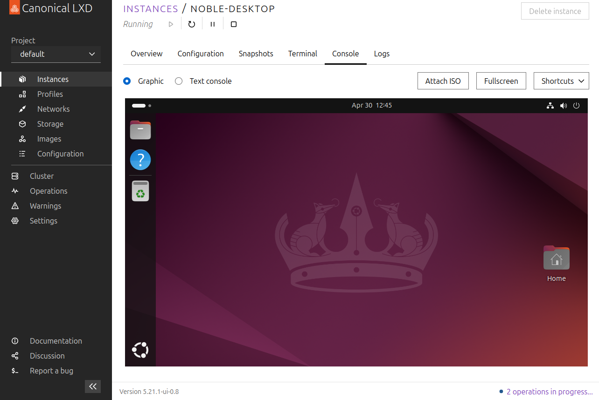

(access-ui)=
# How to access the LXD web UI

```{note}
Starting with LXD 5.14, the LXD web UI is available as part of the LXD snap.

See the [LXD-UI GitHub repository](https://github.com/canonical/lxd-ui) for the source code.
```



```{youtube} https://www.youtube.com/watch?v=wqEH_d8LC1k
```

The LXD web UI provides you with a graphical interface to manage your LXD server and instances.
It is currently in an early stage and does not provide full functionality yet, but eventually, it will be an alternative to the LXD command-line client.

Complete the following steps to access the LXD web UI:

1. Enable the UI in the snap:

       snap set lxd ui.enable=true
       snap restart --reload lxd

1. Make sure that your LXD server is {ref}`exposed to the network <server-expose>`.
   You can expose the server during {ref}`initialization <initialize>`, or afterwards by setting the [`core.https_address`](server-options-core) server configuration option.

1. Access the UI in your browser by entering the server address (for example, `https://192.0.2.10:8443`).

   If you have not set up a secure {ref}`authentication-server-certificate`, LXD uses a self-signed certificate, which will cause a security warning in your browser.
   Use your browser's mechanism to continue despite the security warning.

   

1. Set up the certificates that are required for the UI client to authenticate with the LXD server by following the steps presented in the UI.
   These steps include creating a set of certificates, adding the private key to your browser, and adding the public key to the server's trust store.

   See {ref}`authentication` for more information.

   

After setting up the certificates, you can start creating instances, editing profiles, or configuring your server.
