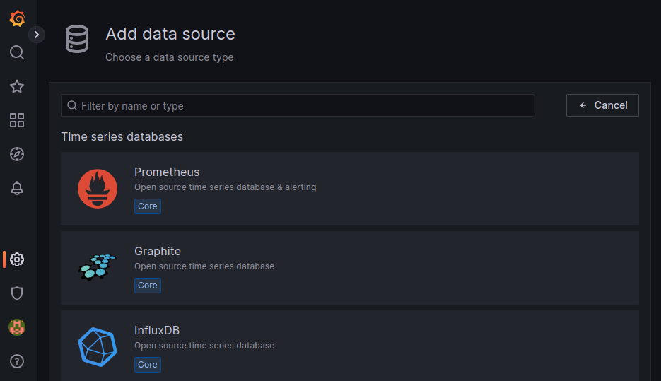
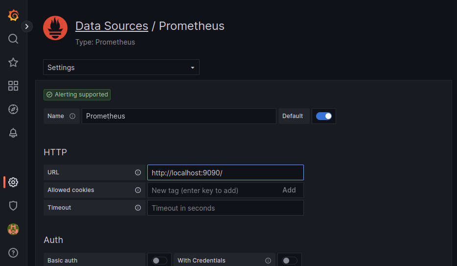

(metrics)=
# How to monitor metrics

```{youtube} https://www.youtube.com/watch?v=EthK-8hm_fY
```

<!-- Include start metrics intro -->
LXD collects metrics for all running instances as well as some internal metrics.
These metrics cover the CPU, memory, network, disk and process usage.
They are meant to be consumed by Prometheus, and you can use Grafana to display the metrics as graphs.
See {ref}`provided-metrics` for lists of available metrics.
<!-- Include end metrics intro -->

In a cluster environment, LXD returns only the values for instances running on the server that is being accessed.
Therefore, you must scrape each cluster member separately.

The instance metrics are updated when calling the `/1.0/metrics` endpoint.
To handle multiple scrapers, they are cached for 8 seconds.
Fetching metrics is a relatively expensive operation for LXD to perform, so if the impact is too high, consider scraping at a higher than default interval.

## Query the raw data

To view the raw data that LXD collects, use the `lxc query` command to query the `/1.0/metrics` endpoint:

```{terminal}
:input: lxc query /1.0/metrics

# HELP lxd_cpu_seconds_total The total number of CPU time used in seconds.
# TYPE lxd_cpu_seconds_total counter
lxd_cpu_seconds_total{cpu="0",mode="system",name="u1",project="default",type="container"} 60.304517
lxd_cpu_seconds_total{cpu="0",mode="user",name="u1",project="default",type="container"} 145.647502
lxd_cpu_seconds_total{cpu="0",mode="iowait",name="vm",project="default",type="virtual-machine"} 4614.78
lxd_cpu_seconds_total{cpu="0",mode="irq",name="vm",project="default",type="virtual-machine"} 0
lxd_cpu_seconds_total{cpu="0",mode="idle",name="vm",project="default",type="virtual-machine"} 412762
lxd_cpu_seconds_total{cpu="0",mode="nice",name="vm",project="default",type="virtual-machine"} 35.06
lxd_cpu_seconds_total{cpu="0",mode="softirq",name="vm",project="default",type="virtual-machine"} 2.41
lxd_cpu_seconds_total{cpu="0",mode="steal",name="vm",project="default",type="virtual-machine"} 9.84
lxd_cpu_seconds_total{cpu="0",mode="system",name="vm",project="default",type="virtual-machine"} 340.84
lxd_cpu_seconds_total{cpu="0",mode="user",name="vm",project="default",type="virtual-machine"} 261.25
# HELP lxd_cpu_effective_total The total number of effective CPUs.
# TYPE lxd_cpu_effective_total gauge
lxd_cpu_effective_total{name="u1",project="default",type="container"} 4
lxd_cpu_effective_total{name="vm",project="default",type="virtual-machine"} 0
# HELP lxd_disk_read_bytes_total The total number of bytes read.
# TYPE lxd_disk_read_bytes_total counter
lxd_disk_read_bytes_total{device="loop5",name="u1",project="default",type="container"} 2048
lxd_disk_read_bytes_total{device="loop3",name="vm",project="default",type="virtual-machine"} 353280
...
```

## Set up Prometheus

To gather and store the raw metrics, you should set up [Prometheus](https://prometheus.io/).
You can then configure it to scrape the metrics through the metrics API endpoint.

### Expose the metrics endpoint

To expose the `/1.0/metrics` API endpoint, you must set the address on which it should be available.

To do so, you can set either the [`core.metrics_address`](server-options-core) server configuration option or the [`core.https_address`](server-options-core) server configuration option.
The `core.metrics_address` option is intended for metrics only, while the `core.https_address` option exposes the full API.
So if you want to use a different address for the metrics API than for the full API, or if you want to expose only the metrics endpoint but not the full API, you should set the `core.metrics_address` option.

For example, to expose the full API on the `8443` port, enter the following command:

    lxc config set core.https_address ":8443"

To expose only the metrics API endpoint on the `8444` port, enter the following command:

    lxc config set core.metrics_address ":8444"

To expose only the metrics API endpoint on a specific IP address and port, enter a command similar to the following:

    lxc config set core.metrics_address "192.0.2.101:8444"

### Add a metrics certificate to LXD

Authentication for the `/1.0/metrics` API endpoint is done through a metrics certificate.
A metrics certificate (type `metrics`) is different from a client certificate (type `client`) in that it is meant for metrics only and doesn't work for interaction with instances or any other LXD entities.

To create a certificate, enter the following command:

    openssl req -x509 -newkey ec -pkeyopt ec_paramgen_curve:secp384r1 -sha384 -keyout metrics.key -nodes -out metrics.crt -days 3650 -subj "/CN=metrics.local"

```{note}
The command requires OpenSSL version 1.1.0 or later.
```

Then add this certificate to the list of trusted clients, specifying the type as `metrics`:

    lxc config trust add metrics.crt --type=metrics

### Make the metrics certificate available for Prometheus

If you run Prometheus on a different machine than your LXD server, you must copy the required certificates to the Prometheus machine:

- The metrics certificate (`metrics.crt`) and key (`metrics.key`) that you created
- The LXD server certificate (`server.crt`) located in `/var/snap/lxd/common/lxd/` (if you are using the snap) or `/var/lib/lxd/` (otherwise)

Copy these files into a `tls` directory that is accessible to Prometheus, for example, `/var/snap/prometheus/common/tls` (if you are using the snap) or `/etc/prometheus/tls` (otherwise).
See the following example commands:

```bash
# Create tls directory
mkdir /var/snap/prometheus/common/tls

# Copy newly created certificate and key to tls directory
cp metrics.crt metrics.key /var/snap/prometheus/common/tls/

# Copy LXD server certificate to tls directory
cp /var/snap/lxd/common/lxd/server.crt /var/snap/prometheus/common/tls/
```

If you are not using the snap, you must also make sure that Prometheus can read these files (usually, Prometheus is run as user `prometheus`):

    chown -R prometheus:prometheus /etc/prometheus/tls

### Configure Prometheus to scrape from LXD

Finally, you must add LXD as a target to the Prometheus configuration.

To do so, edit `/var/snap/prometheus/current/prometheus.yml` (if you are using the snap) or `/etc/prometheus/prometheus.yaml` (otherwise) and add a job for LXD.

Here's what the configuration needs to look like:

```yaml
scrape_configs:
  - job_name: lxd
    metrics_path: '/1.0/metrics'
    scheme: 'https'
    static_configs:
      - targets: ['foo.example.com:8443']
    tls_config:
      ca_file: 'tls/server.crt'
      cert_file: 'tls/metrics.crt'
      key_file: 'tls/metrics.key'
      # XXX: server_name is required if the target name
      #      is not covered by the certificate (not in the SAN list)
      server_name: 'foo'
```

````{note}
The `server_name` must be specified if the LXD server certificate does not contain the same host name as used in the `targets` list.
To verify this, open `server.crt` and check the Subject Alternative Name (SAN) section.

For example, assume that `server.crt` has the following content:

```{terminal}
:input: openssl x509 -noout -text -in /var/snap/prometheus/common/tls/server.crt

...
            X509v3 Subject Alternative Name:
                DNS:foo, IP Address:127.0.0.1, IP Address:0:0:0:0:0:0:0:1
...
```

Since the Subject Alternative Name (SAN) list doesn't include the host name provided in the `targets` list (`foo.example.com`), you must override the name used for comparison using the `server_name` directive.
````

Here is an example of a `prometheus.yml` configuration where multiple jobs are used to scrape the metrics of multiple LXD servers:

```yaml
scrape_configs:
  # abydos, langara and orilla are part of a single cluster (called `hdc` here)
  # initially bootstrapped by abydos which is why all 3 targets
  # share the same `ca_file` and `server_name`. That `ca_file` corresponds
  # to the `/var/snap/lxd/common/lxd/cluster.crt` file found on every member of
  # the LXD cluster.
  #
  # Note: the `project` param is are provided when not using the `default` project
  #       or when multiple projects are used.
  #
  # Note: each member of the cluster only provide metrics for instances it runs locally
  #       this is why the `lxd-hdc` cluster lists 3 targets
  - job_name: "lxd-hdc"
    metrics_path: '/1.0/metrics'
    params:
      project: ['jdoe']
    scheme: 'https'
    static_configs:
      - targets:
        - 'abydos.hosts.example.net:8444'
        - 'langara.hosts.example.net:8444'
        - 'orilla.hosts.example.net:8444'
    tls_config:
      ca_file: 'tls/abydos.crt'
      cert_file: 'tls/metrics.crt'
      key_file: 'tls/metrics.key'
      server_name: 'abydos'

  # jupiter, mars and saturn are 3 standalone LXD servers.
  # Note: only the `default` project is used on them, so it is not specified.
  - job_name: "lxd-jupiter"
    metrics_path: '/1.0/metrics'
    scheme: 'https'
    static_configs:
      - targets: ['jupiter.example.com:9101']
    tls_config:
      ca_file: 'tls/jupiter.crt'
      cert_file: 'tls/metrics.crt'
      key_file: 'tls/metrics.key'
      server_name: 'jupiter'

  - job_name: "lxd-mars"
    metrics_path: '/1.0/metrics'
    scheme: 'https'
    static_configs:
      - targets: ['mars.example.com:9101']
    tls_config:
      ca_file: 'tls/mars.crt'
      cert_file: 'tls/metrics.crt'
      key_file: 'tls/metrics.key'
      server_name: 'mars'

  - job_name: "lxd-saturn"
    metrics_path: '/1.0/metrics'
    scheme: 'https'
    static_configs:
      - targets: ['saturn.example.com:9101']
    tls_config:
      ca_file: 'tls/saturn.crt'
      cert_file: 'tls/metrics.crt'
      key_file: 'tls/metrics.key'
      server_name: 'saturn'
```

After editing the configuration, restart Prometheus (for example, `snap restart prometheus`) to start scraping.

## Set up a Grafana dashboard

To visualize the metrics data, set up [Grafana](https://grafana.com/).
LXD provides a [Grafana dashboard](https://grafana.com/grafana/dashboards/19131-lxd/) that is configured to display the LXD metrics scraped by Prometheus.

```{note}
The dashboard requires Grafana 8.4 or later.
```

See the Grafana documentation for instructions on installing and signing in:

- [Install Grafana](https://grafana.com/docs/grafana/latest/setup-grafana/installation/)
- [Sign in to Grafana](https://grafana.com/docs/grafana/latest/setup-grafana/sign-in-to-grafana/)

Complete the following steps to import the [LXD dashboard](https://grafana.com/grafana/dashboards/19131-lxd/):

1. Configure Prometheus as the data source:

   1. Go to {guilabel}`Configuration` > {guilabel}`Data sources`.
   1. Click {guilabel}`Add data source`.

      

   1. Select {guilabel}`Prometheus`.

      

   1. In the {guilabel}`URL` field, enter `http://localhost:9090/`.

      

   1. Keep the default configuration for the other fields and click {guilabel}`Save & test`.

1. Import the LXD dashboard:

   1. Go to {guilabel}`Dashboards` > {guilabel}`Browse`.
   1. Click {guilabel}`New` and select {guilabel}`Import`.

      

   1. In the {guilabel}`Import via grafana.com` field, enter the dashboard ID `19131`.

      

   1. Click {guilabel}`Load`.
   1. In the {guilabel}`LXD` drop-down menu, select the Prometheus data source that you configured.

      

   1. Click {guilabel}`Import`.

You should now see the LXD dashboard.
You can select the project and filter by instances.


At the bottom of the page, you can see data for each instance.


