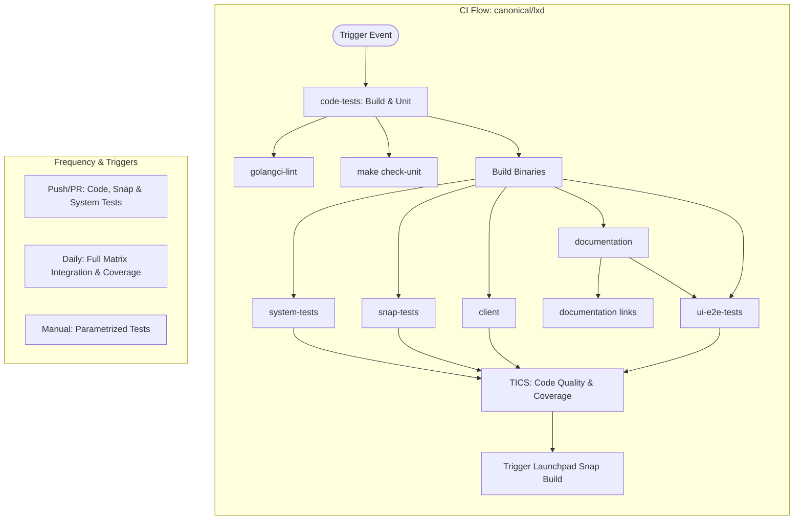
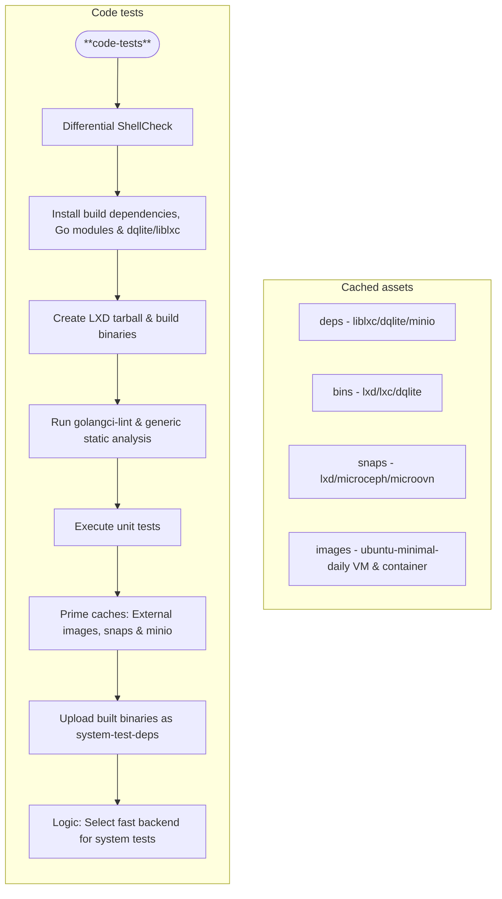
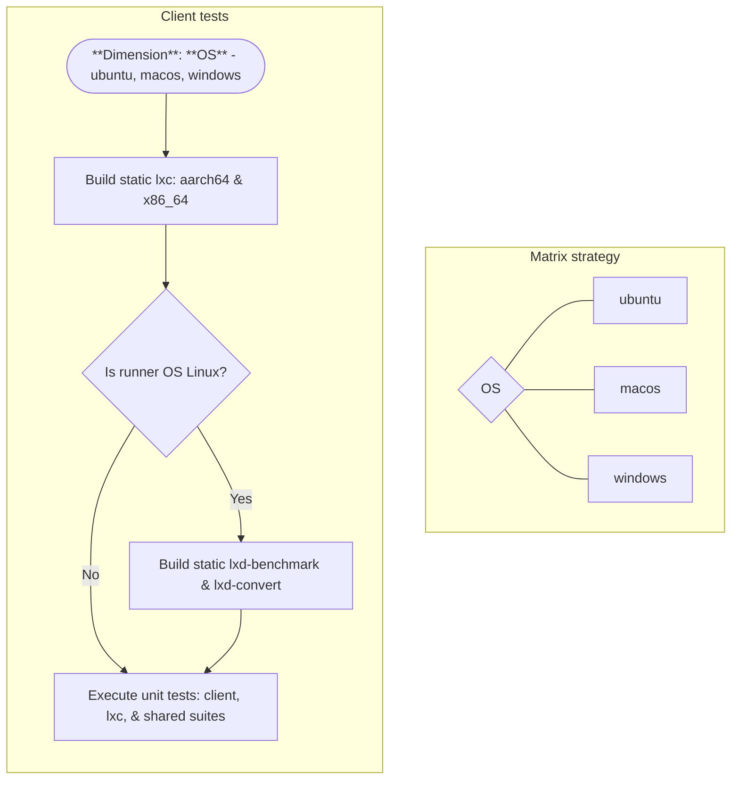
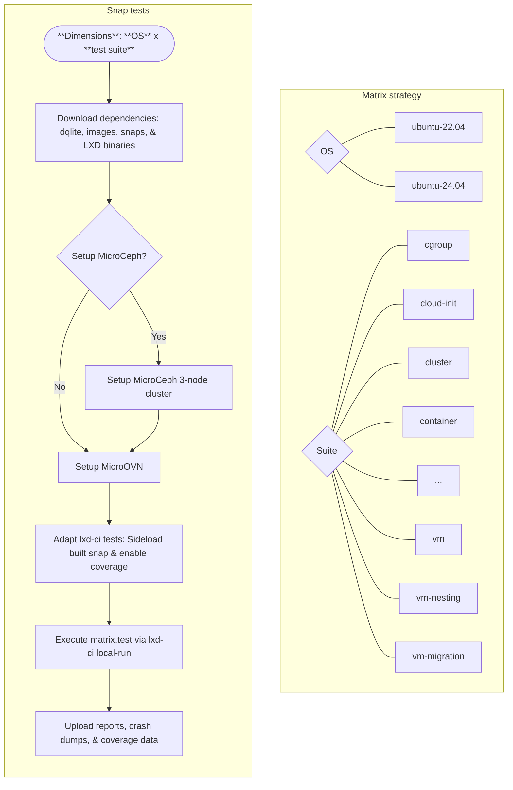
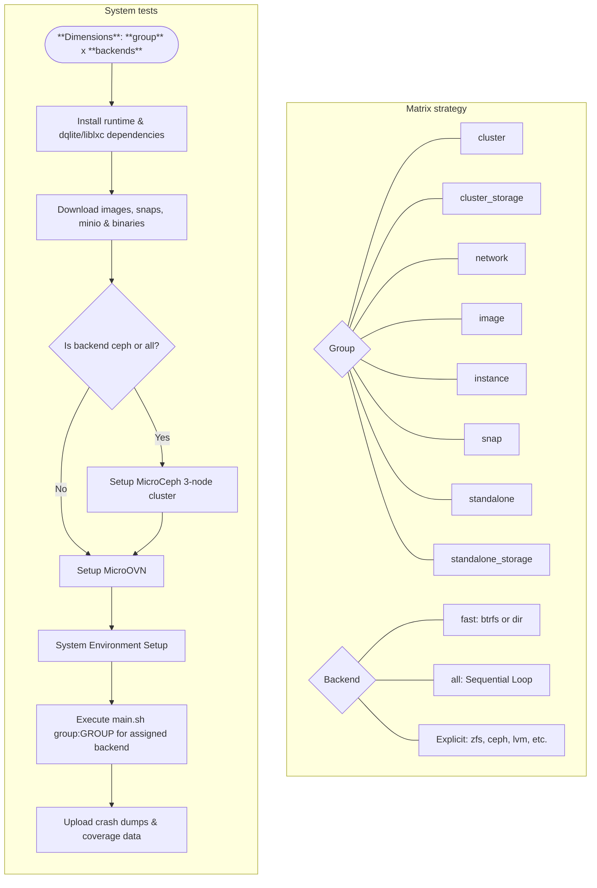
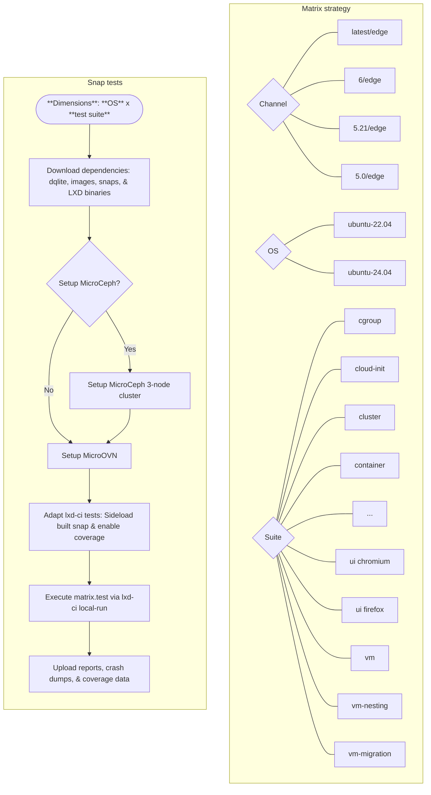

# LXD testing

The testing of LXD is split across two primary repositories: [`canonical/lxd`](https://github.com/canonical/lxd), which handles core code tests and functional integration, and [`canonical/lxd-ci`](https://github.com/canonical/lxd-ci), which focuses on distribution-specific image building and snap integration tests ran on schedule and against supported snap channels.

## `canonical/lxd`

Testing happens on GitHub-hosted runners that are `amd64` based runners.

### Code tests

The **`code-tests`** job acts as the primary build and verification stage, providing the binaries and environment state required for all downstream integration tests.

* **Static Verification**: Performs immediate code quality checks via `ShellCheck` and `golangci-lint` to catch issues before resource-heavy tests begin.
* **Dependency Management**: Consolidates the installation of system-level build dependencies and complex C-based libraries like `dqlite` and `liblxc`.
* **Artifact Preparation**: Builds a distribution tarball and compiles the full set of LXD binaries (e.g., `lxc`, `lxd`, `lxd-agent`, `fuidshift`), which are then uploaded for use by the `system-tests` and `snap-tests` jobs.
* **Cache Priming**: Pre-downloads large external assets like test images and snap dependencies to reduce execution time in subsequent matrix jobs.
* **Integration Logic**: Randomly determines a "fast backend" (`btrfs` or `dir`) to pass to downstream jobs, ensuring integration tests run against at least one efficient storage driver during PR validation.

### Client tests

The **`client`** job validates the LXD command-line tools across different operating systems to ensure cross-platform compatibility.

* **Cross-Platform Matrix**: Executes on Ubuntu, macOS, and Windows runners to verify the LXD client environment globally.
* **Static Compilation**: Builds static versions of the `lxc` tool for both `arm64` and `amd64` architectures on all target platforms.
* **Tool Building**: Additional tools like `lxd-benchmark` and `lxd-convert` are built specifically on Linux runners.
* **Test Suites**: Runs three distinct sets of unit tests covering the client library, the `lxc` command-line logic, and shared utility code.
* **Artifact Preservation**: If the workflow is triggered by a `push` event, the built binaries are uploaded as job artifacts for distribution or further testing.

### Snap tests

The **`snap-tests`** job validates LXD's behavior as a snap package across different Ubuntu releases, utilizing test scripts and infrastructure from the `canonical/lxd-ci` repository.

* **External Integration**: Unlike other jobs, this specifically checkouts the `canonical/lxd-ci` repository to reuse its specialized testing scripts.
* **Infrastructure Preparation**: Dynamically configures **MicroCeph** and **MicroOVN** to provide clustered storage and networking services needed for the snap-based integration tests.
* **Test Adaptation**: Customizes the `lxd-ci` environment on the fly to "sideload" the LXD snap built during the current run, ensuring the CI tests the exact code changes being proposed.
* **Matrix Dimensions**:
  * **OS**: Validates compatibility across multiple Ubuntu releases (e.g., `22.04`, `24.04`).
  * **Test Suites**: Runs over 35 specific functional tests, including `cloud-init`, `network-ovn`, `vm-migration`, and various `storage-vm` backends.
* **Resource Management**: Includes aggressive memory and disk space reclamation steps to ensure the GitHub runner has enough headroom for intensive virtual machine tests.

### System tests

The **`system-tests`** job is an integration suite that executes functional test groups against various storage backends.

* **Matrix Dimensions**: The job runs across eight functional groups (`cluster`, `cluster_storage`, `image`, `instance`, `network`, `snap`, `standalone`, `standalone_storage`) and six storage backends (`btrfs`, `ceph`, `dir`, `lvm`, `zfs`, `random`).
* **Sequential vs. Parallel**:
  * For the `standalone_storage` group, backends are tested in **parallel** (one backend per runner).
  * For the `cluster_storage` and `snap` groups, all backends are tested **sequentially** on a single runner.

* **Infrastructure**: The suite dynamically deploys **MicroCeph** (if required) and **MicroOVN** on the runner to provide the necessary clustered storage and networking environment.
* **Binaries**: This job does not compile LXD; it downloads the binaries built in the previous `code-tests` stage.

## `canonical/lxd-ci`

Most of the test happens on GitHub-hosted runners that are `amd64` based runners. Some tests however require access to specialized hardware and for those, **Testflinger** runners are used.

### Snap integration tests

The **`system-tests`** job executes a massive matrix of functional tests across multiple LXD snap tracks and Ubuntu releases.

* **Matrix Strategy**: This job runs a three-dimensional matrix combining two Ubuntu versions (`22.04`, `24.04`), four snap tracks (`latest/edge`, `6/edge`, `5.21/edge`, `5.0/edge`), and 35 distinct test suites.
* **Specialized Infrastructure**:
  * **MicroCeph**: Setup for storage-related tests (e.g., `storage-vm ceph`).
  * **VM Caching**: Specifically handles external VM images for the `qemu-external-vm` suite to speed up execution.
  * **Node.js**: Installed only when executing browser-based UI tests.
* **Test Execution**: Uses the `./bin/local-run` helper script to trigger the specific logic for each test suite defined in the matrix.
* **Release Logic**: Includes specific logic to exclude incompatible combinations, such as skipping `lxd-installer` tests on older snap tracks or older Ubuntu releases.

### GPU passthrough tests

This workflow is a pipeline that automates the validation of NVIDIA GPU passthrough for containers using specialized hardware.

* **Specialized Infrastructure**: These tests execute on **self-hosted** runners due to needing to launch jobs via [Testflinger](https://canonical-testflinger.readthedocs-hosted.com/latest/) that is not accessible from GitHub-hosted runners.
* **Testflinger Integration**: The workflow does not run the tests directly on the **self-hosted** runner; instead, it uses the `canonical/testflinger` action to submit jobs to a dedicated hardware queue ([`lxd-nvidia`](https://testflinger.canonical.com/queues/lxd-nvidia)) with a set of physical machine with the needed hardware available.
* **Test Variants**:
  * **CDI Tests**: Validates the modern **Container Device Interface** (CDI) passthrough on both Ubuntu Core 24 and standard Ubuntu releases.
  * **Legacy Runtime**: Validates the older NVIDIA container runtime method to ensure backward compatibility.
* **Frequency**: These intensive hardware tests are triggered by changes to the workflow or Testflinger configurations, and otherwise run on a scheduled basis every five days.
